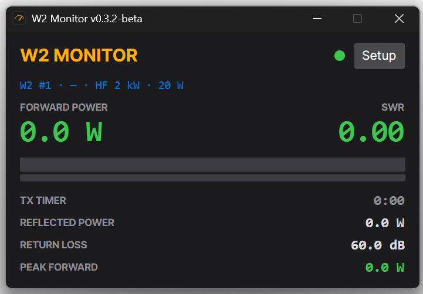
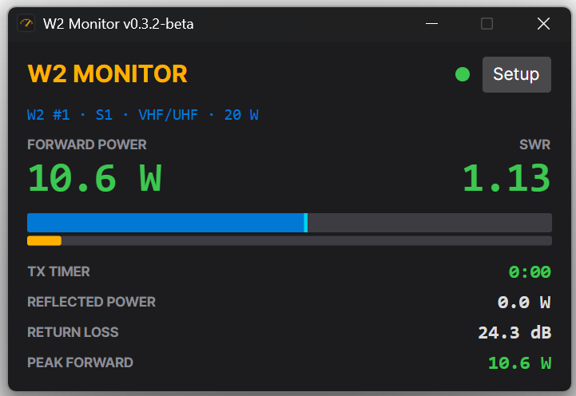
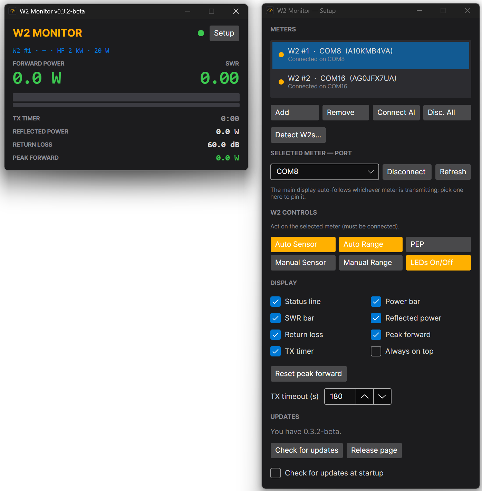

# W2 Monitor

A modern, dark-themed desktop monitor for **Elecraft W2** RF power / SWR meters —
multi-meter, full W2 control, and a transmit-timeout timer — for **Windows, Linux, and
Raspberry Pi**. Built with .NET 8 + Avalonia.

[](https://github.com/gsa700/w2-monitor-x/releases)
[](LICENSE)




> **Beta:** validated on real hardware across **Windows, Linux, and Raspberry Pi** (identical
> behavior on each) — in active use, but not yet broadly field-tested across many stations. This
> is the cross-platform successor to the original (now retired) PowerShell
> [W2 Monitor](https://github.com/gsa700/w2-monitor).

## Features

- **Live readout** — forward power, SWR (green/amber/red), reflected power, return loss, and a
  stacked power/SWR bar with a **peak-hold marker**.
- **Multiple W2 meters at once** — each on its own background thread; the display auto-focuses
  whichever meter is transmitting. **Detect** finds connected meters.
- **Full W2 control** from Setup (acts on the selected meter): Auto Sensor, Auto Range, Avg/PEP,
  Manual Sensor, Manual Range, LEDs — with live lamp states.
- **TX-timeout timer** — solid yellow 30 s before timeout, flashing red at/after (silent).
- **Follows your cable** by its USB chip serial (Windows) or `/dev/serial/by-id` (Linux), so a
  meter keeps its identity across port renumbering.
- **In-app updater**, display toggles, and window/meter state that persists between sessions.

## Screenshots

Transmitting — live power and SWR with the cyan peak-hold marker riding the bar:



The Setup window — meters (with each cable's serial), W2 controls, display toggles, and the
in-app updater:



## Install

1. Download the build for your platform from the
   [latest release](https://github.com/gsa700/w2-monitor-x/releases/latest):
   - **Windows:** `W2Monitor-win-x64.zip`
   - **Linux:** `W2Monitor-linux-x64.zip`
   - **Raspberry Pi:** `W2Monitor-linux-arm64.zip`
2. Extract it. The build is **self-contained** — no .NET install required.
3. Run **`W2Monitor`** (`W2Monitor.exe` on Windows). On Linux you may need `chmod +x W2Monitor` first.

Then click **Setup**, add your W2's port (or **Detect**), and **Connect**.

## Requirements

- An **Elecraft W2** on a serial/USB (FTDI) port.
- **Windows 10/11**, or a modern **Linux** desktop, or **Raspberry Pi OS** (64-bit).

## Linux / Raspberry Pi

- **Serial permissions:** opening `/dev/ttyUSB*`/`/dev/ttyACM*` requires membership in the
  `dialout` group. If a connection fails with a permission error, run
  `sudo usermod -aG dialout $USER` and log out/in. (The app surfaces this hint on the error.)
- **Cable pinning:** on Linux the app pins each W2 by its stable `/dev/serial/by-id/*` name and
  follows it to whatever `/dev/tty*` it currently maps to — the non-Windows analog of the Windows
  FTDI chip-serial pinning, so a replug/renumber doesn't lose the meter.
- **Raspberry Pi:** use the `linux-arm64` build (Avalonia/Skia renderer); validated on a Pi CM5.
  The reader auto-reconnects and follows the cable by its `by-id` serial across USB drops/renumbers.

## Build from source

```sh
dotnet build                                   # requires the .NET 8 SDK
dotnet run --project src/W2.App                # run
dotnet run --project src/W2.App -- --sim       # no hardware? drive it from a synthetic meter
dotnet test                                    # run the test suite
```

```
src/
  W2.Core/   # no UI: serial reader + W2 query/response protocol (9600 8N1)
  W2.App/    # Avalonia MVVM: views, view-models, services (PortIdentity, updater, config)
```

## License

Released under the **[GNU General Public License v3.0](LICENSE)**. *Elecraft* is a trademark of
its owner; this is an independent project, provided without warranty. Created by
**David Erickson (AB0R)** in collaboration with Claude.

73! 📻
