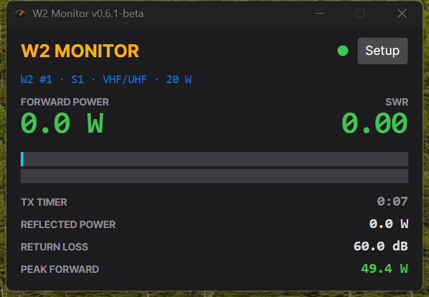
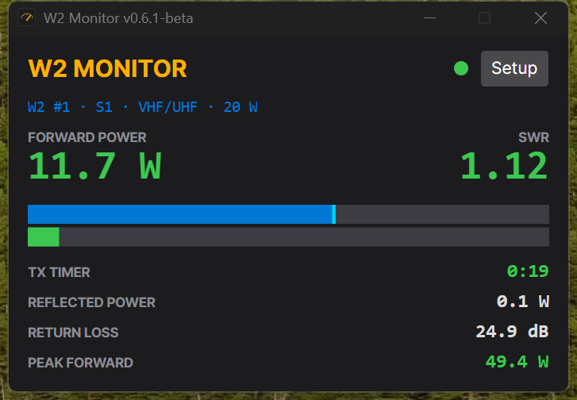
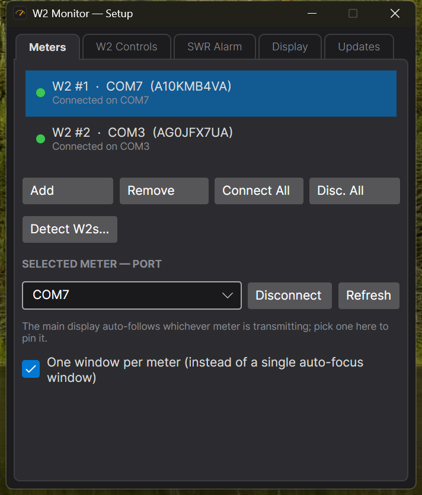
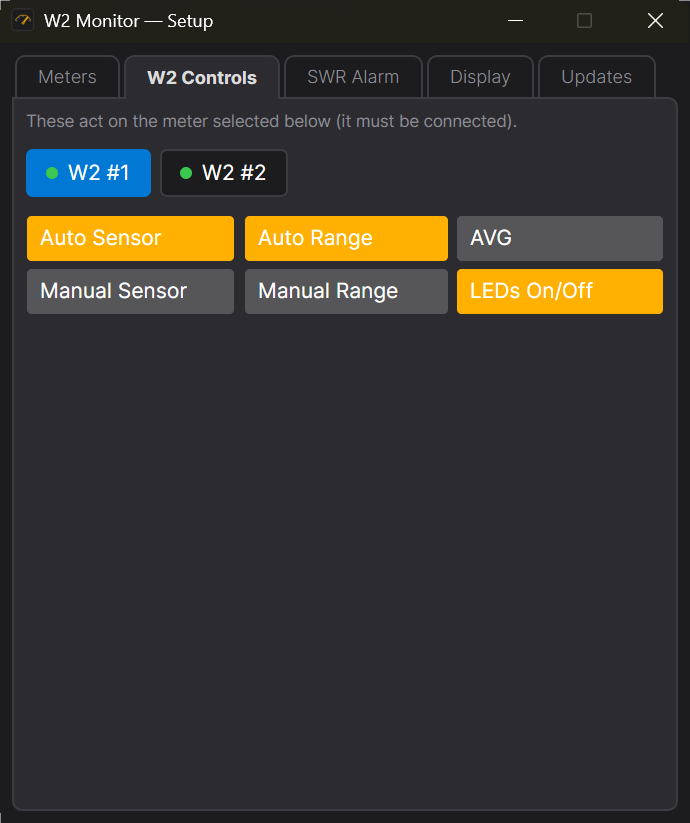
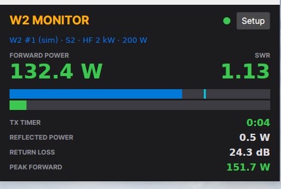
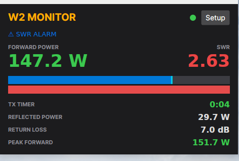

# W2 Monitor

A modern, dark-themed desktop monitor for **Elecraft W2** RF power / SWR meters —
multi-meter, full W2 control, and a transmit-timeout timer — for **Windows, Linux, and
Raspberry Pi**. Built with .NET 10 + Avalonia.

[](https://github.com/gsa700/w2-monitor-x/releases)
[](LICENSE)




> **Beta:** validated on real hardware across **Windows, Linux, and Raspberry Pi** (identical
> behavior on each) — in active use, but not yet broadly field-tested across many stations. This
> is the cross-platform successor to the original (now retired) PowerShell
> [W2 Monitor](https://github.com/gsa700/w2-monitor).

## Features

- **Live readout** — forward power, SWR (green/amber/red), reflected power, return loss, and a
  stacked power/SWR bar with a **peak-hold marker**.
- **Multiple W2 meters at once** — each on its own background thread; the main display
  auto-focuses whichever meter is transmitting (the **strongest**, if several key at once —
  the others keep tracking in the background; pin one in **Setup** to watch it). **Detect**
  finds connected meters. With several meters you can also give each its **own window**
  (Setup → Meters → *One window per meter*) and lay them out side-by-side; your layout is remembered.
- **Steady in Search mode** — when the W2 hunts between its two samplers, the readout locks to
  the sampler carrying your over and ignores stray RF the meter picks up on the other. Applied
  per meter, so it holds independently across multiple W2s.
- **Full W2 control** from Setup (acts on the selected meter): Auto Sensor, Auto Range, Avg/PEP,
  Manual Sensor, Manual Range, LEDs — with live lamp states.
- **SWR alarm** — the SWR bar is colored so it "goes red where your alarm trips," and flashes on a
  live alarm. Set the trip point, reset a latched alarm, or toggle latching from Setup — it drives
  the W2's rear-panel keyline disconnect relay.
- **TX-timeout timer** — solid yellow 30 s before timeout, flashing red at/after (silent).
- **Follows your cable** by its USB chip serial (Windows) or `/dev/serial/by-id` (Linux), so a
  meter keeps its identity across port renumbering.
- **Installs itself** — no installer to run and nothing to build. It offers to put itself in the
  usual per-user place and register with your desktop, or you can keep running it from wherever you
  unzipped it. See [Install](#install).
- **In-app updater**, display toggles, and window/meter state that persists between sessions.

## Screenshots

Transmitting — live power and SWR with the cyan peak-hold marker riding the bar:



The Setup window — tabbed into Meters, W2 Controls, SWR Alarm, Display and Updates. Each meter is
listed with the USB chip serial of the cable it's on, so the two are told apart by hardware rather
than by whichever COM port Windows handed out this week:



The W2 Controls tab. The meter picker at the top is the same selection as the Meters tab — pick a
meter in either place and both follow, so there's never a doubt about which W2 a button is about to
act on. Lit buttons show the meter's current state: here W2 #1 has Auto Sensor, Auto Range and its
sampler LEDs on, and the Avg/PEP button reads its current mode — average:



### On Linux and Raspberry Pi

The same build on a **Raspberry Pi CM5** — arm64, labwc/Wayland — with the layout and behavior
identical to the Windows shots above. These come from the built-in simulator (`--sim`), which drives
the UI from synthetic W2s, so the readings are generated rather than off-air:



The SWR alarm firing. Past the trip point the SWR bar turns red and the alarm replaces the status
line — the same condition that drives the W2's rear-panel keyline-disconnect relay:



## Install

1. Download the build for your platform from the
   [latest release](https://github.com/gsa700/w2-monitor-x/releases/latest):
   - **Windows:** `W2Monitor-win-x64.zip`
   - **Linux:** `W2Monitor-linux-x64.zip`
   - **Raspberry Pi:** `W2Monitor-linux-arm64.zip`
2. Extract it. The build is **self-contained** — no .NET install required.
3. Run **`W2Monitor`** (`W2Monitor.exe` on Windows). On Linux you may need `chmod +x W2Monitor` first.
4. It offers to **install itself**. Say yes and it copies into the per-user application folder and
   registers with your desktop; say *Not now* and it just runs from where it is.

Then open **Setup**, add your W2's port (or **Detect**), and **Connect**.

### About installing

Installing is per-user and needs no administrator rights — that's required rather than chosen, since
the in-app updater replaces the running program in place.

| | Windows | Linux / Raspberry Pi |
|---|---|---|
| Goes in | `%LOCALAPPDATA%\Programs\W2 Monitor` | `~/.local/share/w2-monitor` |
| Appears in | Settings → Apps → Installed apps, plus a Start Menu shortcut | your applications menu, plus a `~/.local/bin/w2-monitor` symlink |
| Remove with | the entry in Installed apps | `w2-monitor --uninstall` |

Prefer to keep it where it is? Put an empty file named **`portable.txt`** beside the program and it
will never ask again or touch anything outside its own folder. Uninstalling keeps your settings
unless you explicitly say otherwise, and `--install` / `--uninstall` work unattended if you'd rather
script it.

**Want a shortcut on your desktop?** Installing doesn't put one there — it registers the app with your
Start Menu (Windows) or applications menu (Linux), and a desktop icon is a matter of taste. Make one
with your OS's own tools:
- **Windows:** find **W2 Monitor** in the Start Menu, then drag it to the desktop — or right-click the
  installed `W2Monitor.exe` → **Show more options** → **Send to** → **Desktop (create shortcut)**.
- **Linux:** use your desktop's "add to favorites / create launcher" option, or copy
  `~/.local/share/applications/w2-monitor.desktop` to your `Desktop` folder and mark it trusted.

## Requirements

- An **Elecraft W2** on a serial/USB (FTDI) port.
- **Windows 10/11**, or a modern **Linux** desktop, or **Raspberry Pi OS** (64-bit).

## Linux / Raspberry Pi

- **Serial permissions:** opening `/dev/ttyUSB*`/`/dev/ttyACM*` requires membership in the
  `dialout` group. If a connection fails with a permission error, run
  `sudo usermod -aG dialout $USER` and log out/in. (The app surfaces this hint on the error.)
- **Cable pinning:** on Linux the app pins each W2 by its stable `/dev/serial/by-id/*` name and
  follows it to whatever `/dev/tty*` it currently maps to — the non-Windows analog of the Windows
  FTDI chip-serial pinning, so a replug/renumber doesn't lose the meter.
- **Raspberry Pi:** use the `linux-arm64` build (Avalonia/Skia renderer); validated on a Pi CM5.
  The reader auto-reconnects and follows the cable by its `by-id` serial across USB drops/renumbers.
- **Installing on Linux is new and not yet shaken down on real hardware** (as of 0.6.0-beta). The
  monitor itself is well tested here; it's the install/uninstall paths — the menu entry, icon,
  symlink and removal — that haven't been run on a Linux box yet. Until they have, running it from
  where you unzipped it (or dropping a `portable.txt` beside it) is the conservative choice.

## Reporting a problem

Please open an [issue](https://github.com/gsa700/w2-monitor-x/issues) — and if the app closed
unexpectedly, **attach `crash.log`**. It records unhandled errors with the version, platform and
stack trace, and it's the difference between a fixable report and "it closed."

| | |
|---|---|
| **Windows** | `%APPDATA%\W2Monitor\crash.log` — paste that into Explorer's address bar |
| **Linux / Pi** | `~/.config/W2Monitor/crash.log` |

The file holds only the last few reports, and it won't exist at all if the app has never crashed —
which is the normal case. `config.json` sits in the same folder and is worth including too: it shows
your meter setup and display options, minus anything personal.

## Build from source

```sh
dotnet build                                   # requires the .NET 10 SDK
dotnet run --project src/W2.App                # run
dotnet run --project src/W2.App -- --sim       # no hardware? drive it from a synthetic meter
dotnet test                                    # run the test suite
```

```
src/
  W2.Core/   # no UI: serial reader + W2 query/response protocol (9600 8N1)
  W2.App/    # Avalonia MVVM: views, view-models, services (PortIdentity, updater, config)
```

## License

Released under the **[GNU General Public License v3.0](LICENSE)**. *Elecraft* is a trademark of
its owner; this is an independent project, provided without warranty. Created by
**David Erickson (AB0R)** in collaboration with Claude.

73! 📻
